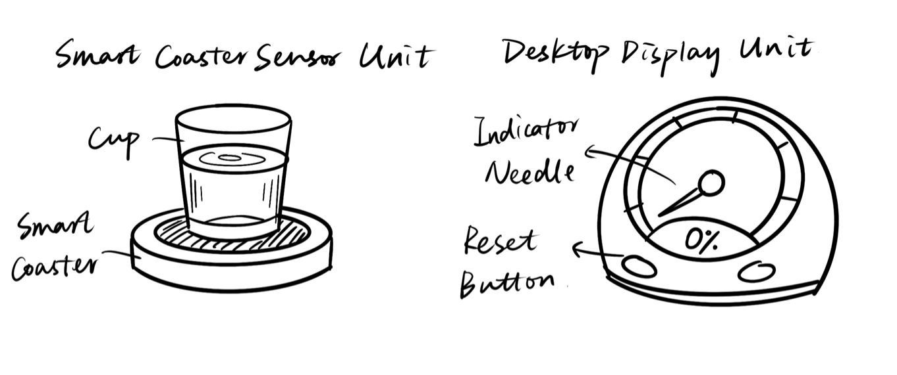
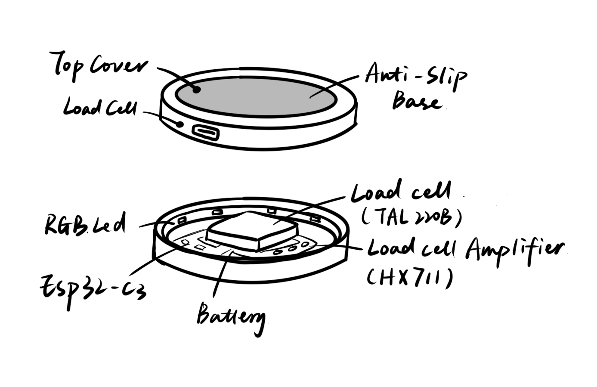
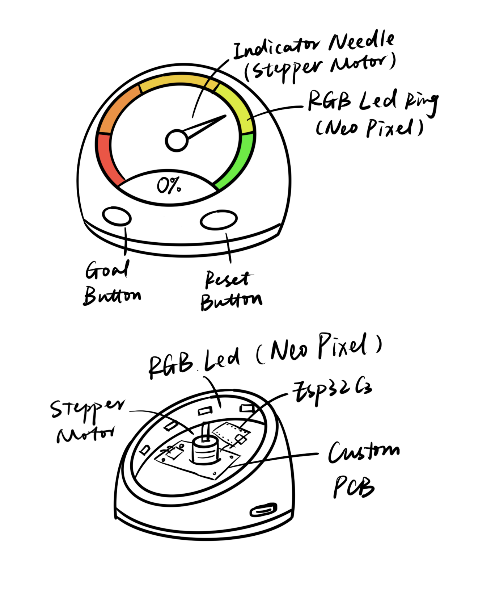
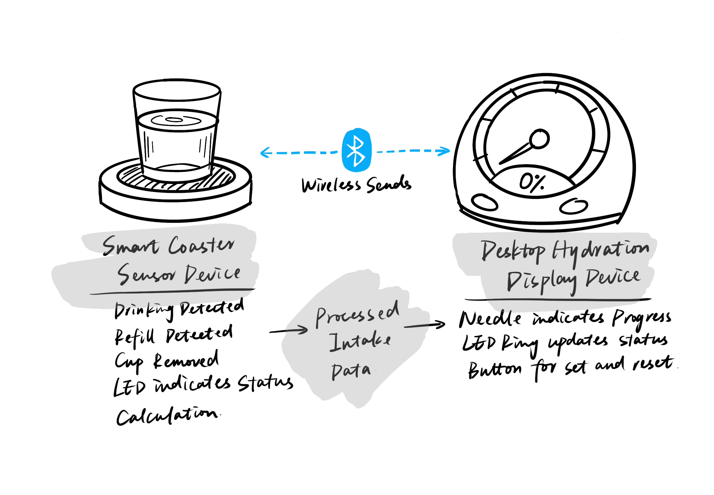
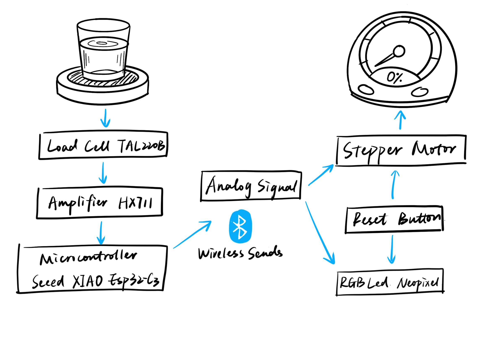
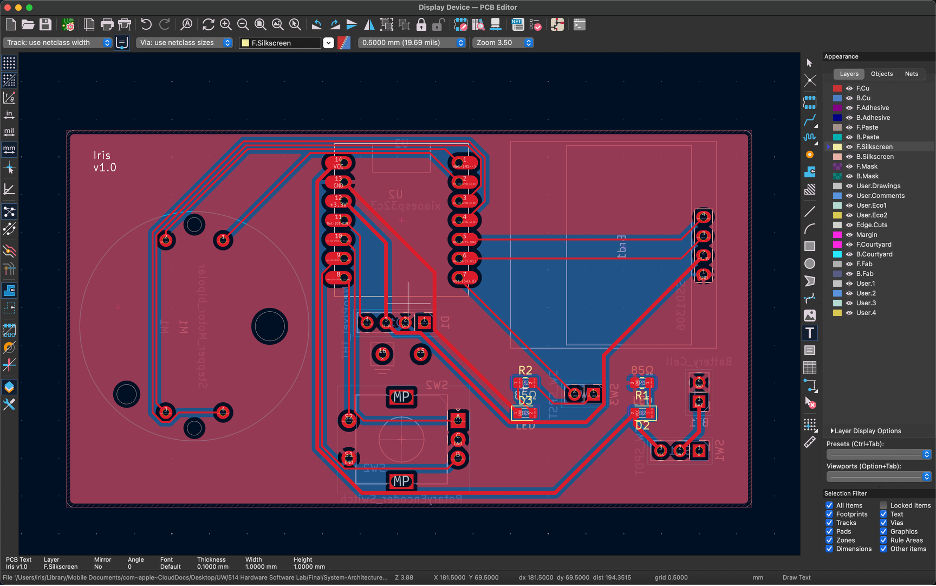

# Smart Water Intake Tracker

*The Smart Water Intake Tracker is a physical, non-intrusive system that helps users track their daily water intake through passive sensing and dynamic feedback.*  

This project consists of a smart sensing coaster and a desktop display device that together track and visualize a user’s daily water intake.

By passively detecting drinking events through weight changes and presenting progress via a mechanical gauge, the system encourages hydration without relying on screens or manual input.

---

## Sensor Device: Smart Coaster

### How it works
The sensing device is a smart coaster placed under a cup or bottle that detects drinking activity by monitoring weight changes. 

A load cell measures the applied force, and the signal is amplified, digitized, and processed by a microcontroller to estimate water intake based on relative weight differences over time.

### Key features
- **Drink Detection**: When the sensor detects that the cup has been lifted, the LED on the coaster begins to pulse, indicating that it's monitoring for weight changes.

- **Upload Status**: Once the weight change is detected and successfully uploaded to the display device, the coaster lights up green for 3 seconds. If the upload fails, it lights up red for 3 seconds instead.

- **Hydration Reminder**: If the system detects that the user hasn't had any water for 2 hours (no weight changes detected), the coaster will pulse to remind the user to stay hydrated.

### Key components
- **RGB LED**: NeoPixel 
- [**TAL221 Load Cell**](Datasheets/TAL221.pdf)  
- [**HX711 Load Cell Amplifier**](Datasheets/hx711_english.pdf)
- [**Seeed Studio XIAO ESP32-C3**](Datasheets/Seeed-Studio-XIAO-Series-SOM-Datasheet.pdf)
- **Communication**: Bluetooth Low Energy (BLE)

---

## Display Device: Desktop Hydration Gauge

### How it works
The display device is a desktop hydration gauge that gives you a quick view of your daily water intake. It has a mechanical needle that shows your progress from 0–100%, an RGB LED ring for color-coded feedback, and a physical reset button to restart daily tracking.

### Key features
- **Visual Progress Tracking**: When the gauge receives a signal from the coaster, the needle moves to show how much water you've drunk today. The OLED screen below displays the exact amount and your progress percentage toward the daily goal.

- **Customizable Goals**: You can press the button below the dial to reset your data, or use the rotary knob to adjust your target water intake. All information shows up on the OLED screen.

### Key components
- **X27 Stepper Motor**
- **RGB LED**: NeoPixel 
- [**Seeed Studio XIAO ESP32-C3**](Datasheets/Seeed-Studio-XIAO-Series-SOM-Datasheet.pdf)
- [**SSD1306 OLED**](Datasheets/SSD1306.pdf) (Show the number)
- [**Rotary encoder**](Datasheets/RotaryEncoder-pec11.pdf) (Set/Change the goal)
- **Reset button**
- **Communication**: Bluetooth Low Energy (BLE)

---

## Device-to-device communication

The smart coaster sends processed intake data to the display device wirelessly using Bluetooth Low Energy (BLE).  
Only high-level intake events (e.g., estimated water consumed) are transmitted, minimizing bandwidth and power usage.

### System workflow
1. The load cell detects weight changes when the user interacts with the cup  
2. The HX711 amplifies and digitizes the signal  
3. The microcontroller filters noise and detects valid drinking events  
4. Estimated intake values are accumulated locally  
5. Intake data is transmitted via BLE to the display device  
6. The display updates the mechanical needle and LED ring in real time  

This modular architecture separates sensing and feedback, making the system easier to debug, extend, and maintain.

## System Architecture

### Schematic

### PCB Design

---

## Datasheets

All component datasheets are included in the `/datasheets` folder of this repository.

- [TAL221 Load Cell Datasheet](Datasheets/TAL221.pdf)  
- [HX711 Load Cell Amplifier](Datasheets/hx711_english.pdf)  
- [Seeed Studio XIAO ESP32-C3](Datasheets/Seeed-Studio-XIAO-Series-SOM-Datasheet.pdf)  
- [OLED SSD1306](Datasheets/SSD1306.pdf)
- [Rotary Encoder](Datasheets/RotaryEncoder-pec11.pdf)