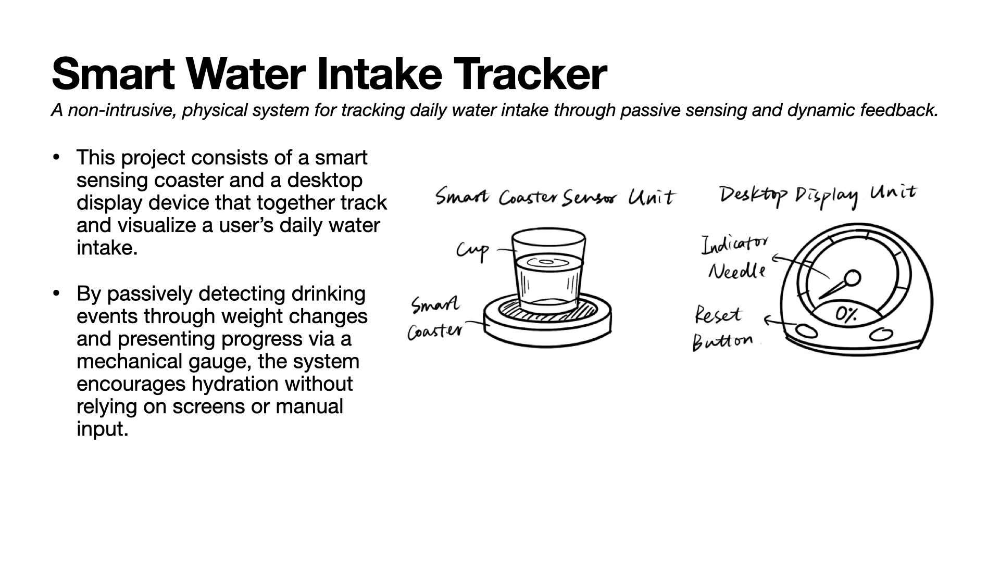
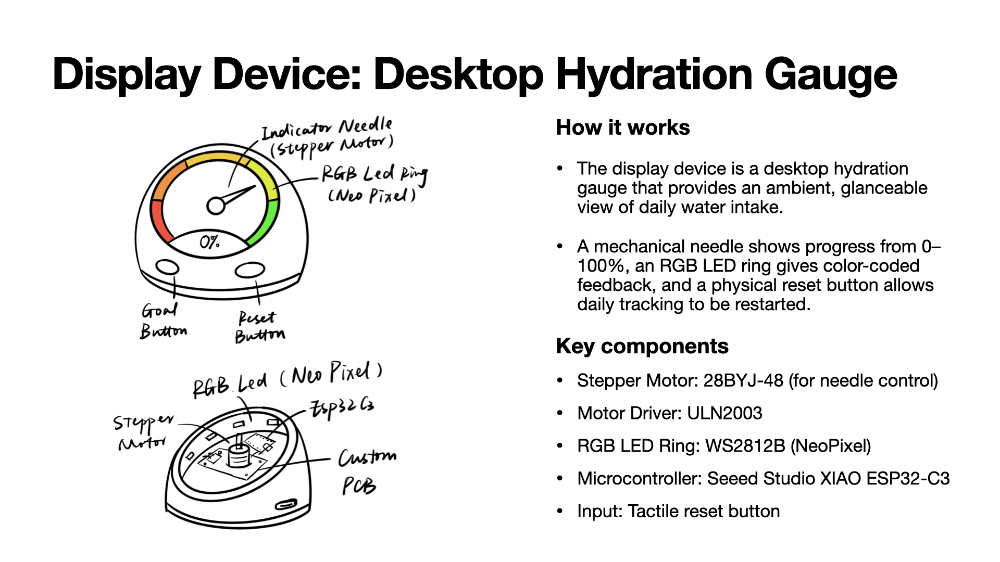
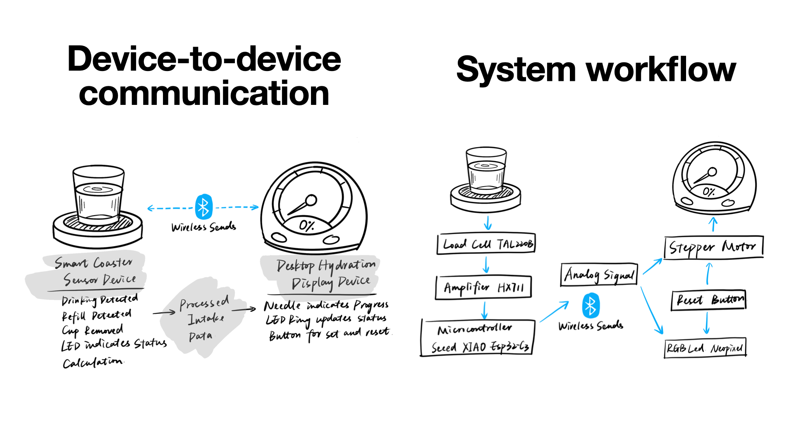

# Smart Water Intake Tracker

*The Smart Water Intake Tracker is a physical, non-intrusive system that helps users track their daily water intake through passive sensing and dynamic feedback.*  

It consists of a smart sensing coaster and a desktop display gauge, allowing users to track hydration progress without relying on screens or manual input.

---

## Sensor Device: Smart Coaster

### How it works
The sensing device is a smart coaster placed under a cup or bottle that detects drinking-related events by monitoring weight changes.  

A load cell measures the applied force, and the signal is amplified, digitized, and processed by a microcontroller to estimate water intake based on relative weight differences over time.

### Key components
- **RGB LED**: WS2812B (NeoPixel) 
- **Load Cell**: TAL220B (5 kg)
- **Load Cell Amplifier**: HX711
- **Microcontroller**: Seeed Studio XIAO ESP32-C3
- **Communication**: Bluetooth Low Energy (BLE)

---

## Display Device: Desktop Hydration Gauge

### How it works
The display device is a desktop hydration gauge that provides an ambient, glanceable view of daily water intake.  

A mechanical needle shows progress from 0–100%, an RGB LED ring provides color-coded feedback, and a physical reset button allows daily tracking to be restarted.

### Key components
- **Stepper Motor**: 28BYJ-48
- **Motor Driver**: ULN2003
- **RGB LED Ring**: WS2812B
- **Microcontroller**: Seeed Studio XIAO ESP32-C3
- **Input**: Tactile reset button

---

## System Architecture

### Device-to-device communication
The smart coaster sends processed intake data to the display device wirelessly using Bluetooth Low Energy (BLE).  
Only high-level intake events (e.g., estimated water consumed) are transmitted, minimizing bandwidth and power usage.

### System workflow
1. The load cell detects weight changes when the user interacts with the cup  
2. The HX711 amplifies and digitizes the signal  
3. The microcontroller filters noise and detects valid drinking events  
4. Estimated intake values are accumulated locally  
5. Intake data is transmitted via BLE to the display device  
6. The display updates the mechanical needle and LED ring in real time  

This modular architecture separates sensing and feedback, making the system easier to debug, extend, and maintain.

---

## Datasheets

All component datasheets are included in the `/datasheets` folder of this repository.

- [TAL220B Load Cell Datasheet](Datasheets/TAL220B.pdf)  
- [HX711 Load Cell Amplifier](Datasheets/hx711_english.pdf)  
- [Seeed Studio XIAO ESP32-C3](Datasheets/Seeed-Studio-XIAO-Series-SOM-Datasheet.pdf)  
- [28BYJ-48 Stepper Motor](Datasheets/GentiamElectronics-28BYJ-48-Stepper-Motor-Datasheet-Rev20220925-final.pdf)  
- [ULN2003 Driver IC](Datasheets/ULN2003.pdf)  
- [WS2812B RGB LED](Datasheets/WS2812B.pdf)